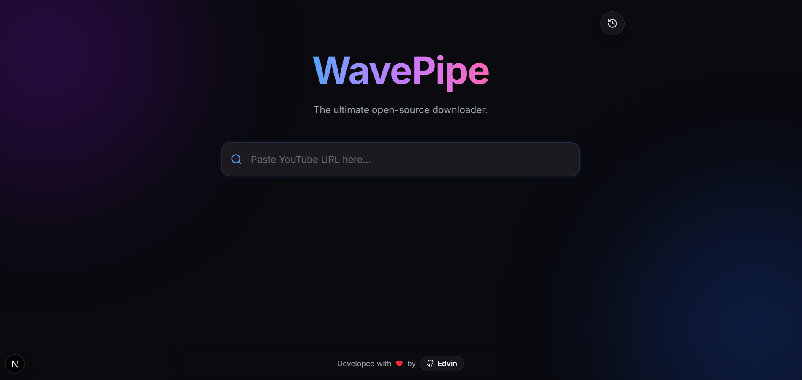

# 🌊 WavePipe

> The ultimate open-source YouTube downloader. Built with the modern web stack.

 

## ✨ Features

- 🚀 **Fast & Clean:** No ads, no tracking, just downloads.
- 🎵 **Format Support:** Convert to **MP3** (Audio) or **MP4** (Video up to 4k).
- 📦 **Playlist Support:** Download entire playlists with a smart queue system.
- 📱 **Responsive Design:** Works perfectly on Desktop and Mobile.
- 💾 **History:** LocalStorage-based history to keep track of your downloads.
- 🌈 **Modern UI:** Glassmorphism design with Framer Motion animations.
- 🏗 **PWA Ready:** Installable as a native app on your device.

## 🛠️ Tech Stack

- **Framework:** [Next.js 16](https://nextjs.org/) (App Router)
- **Styling:** [Tailwind CSS](https://tailwindcss.com/)
- **Animations:** [Framer Motion](https://www.framer.com/motion/)
- **Notifications:** [Sonner](https://sonner.emilkowal.ski/)
- **Core Engine:** [yt-dlp](https://github.com/yt-dlp/yt-dlp)
- **Language:** TypeScript

## 🚀 Getting Started locally

This project requires a backend component (yt-dlp), so it cannot be hosted on Vercel's free tier directly without Docker. Here is how to run it on your machine.

### Prerequisites

1.  **Node.js** (v18 or higher)
2.  **FFmpeg** installed on your system path.
3.  **Python** (required by yt-dlp).

### Installation

1.  Clone the repo:
    ```bash
    git clone [https://github.com/edvincodes/wavepipe.git](https://github.com/edvincodes/wavepipe.git)
    cd wavepipe
    ```

2.  Install dependencies:
    ```bash
    pnpm install
    # or npm install
    ```

3.  **CRITICAL STEP:** Download the engine.
    - Create a folder named `bin` in the root directory.
    - Download the latest [yt-dlp.exe](https://github.com/yt-dlp/yt-dlp/releases) (for Windows) or binary (for Linux/Mac).
    - Place it inside the `/bin` folder.

4.  Run the development server:
    ```bash
    pnpm dev
    ```

5.  Open [http://localhost:3000](http://localhost:3000) with your browser.

## 🤝 Contributing

Contributions, issues, and feature requests are welcome! Feel free to check the [issues page](https://github.com/edvincodes/wavepipe/issues).

## 📝 License

This project is licensed under the MIT License - see the [LICENSE](LICENSE) file for details.

---

Developed with ❤️ by [Edvin](https://github.com/edvincodes)